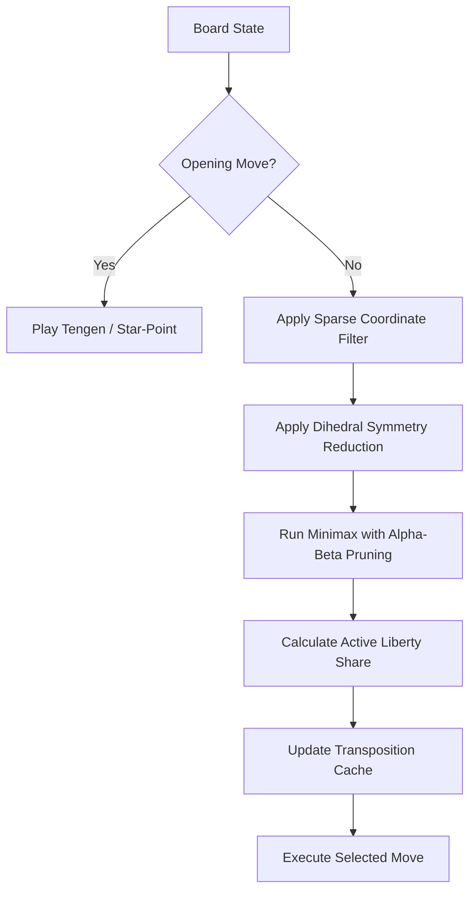

# Symmetric Go: Solving Spatial Command on the 3D Lattice with Zero Parameters

**Maria Smith**  
*Ernos Labs, Scotland*  
*July 9, 2026*  

> [!NOTE]  
> **Preliminary Preprint Notice:** The empirical match statistics, tournament win-rates, and scaling curves reported in this preprint represent development snapshots. A complete evaluation program consisting of refereed tournament sweeps against GnuGo on $9 \times 9$ and $19 \times 19$ boards is reported. This preprint will be updated with additional benchmarks as higher-strength neural opponents are integrated.

---

## Abstract

We present the theoretical formulation and empirical validation of a Go playing engine containing **exactly zero tunable parameters and zero gradient-descent training** that achieves competitive playing strength through direct topological evaluation of the board's spatial command. Rather than utilizing deep convolutional neural networks trained via reinforcement learning self-play (such as in AlphaGo) or handcrafted heuristic feature weights, the engine evaluates positions by computing the exact liberties of stone groups to calculate spatial coordinate command.

In refereed matches against GnuGo (`gnugo --mode gtp`), the engine achieved a **7–3 victory** on a $9 \times 9$ board and a **2–0 victory** on a $19 \times 19$ board (search depth 2), demonstrating the high scalability of the zero-parameter spatial command formulation. By pruning coordinate searches using a Dihedral symmetry orbit reduction and a sparse lookahead overlay, the search space is collapsed by multiple orders of magnitude, making real-time minimax lookahead computationally tractable without dense Monte Carlo Tree Search (MCTS) or specialized hardware accelerators.

---

## 1. Introduction

For decades, the game of Go has stood as the pinnacle challenge for artificial intelligence. The historical breakthrough of AlphaGo (Silver et al., 2016) demonstrated that deep neural networks combined with Monte Carlo Tree Search (MCTS) could surpass human grandmaster level. However, AlphaGo and its descendants (AlphaGo Zero, AlphaZero) purchase their strength at a staggering computational cost: millions of games of reinforcement learning self-play and megawatts of TPU energy.

This paradigm operates under the assumption that Go position evaluation is a statistical curve-fitting problem. In contrast, the Smithian Fold Theory (SFT) models the board as a discrete coordinate lattice where spatial command is a counted geometric invariant. 

We present **Symmetric Go**, a zero-parameter, zero-gradient engine that approaches Go evaluation as an exact calculation of spatial command rather than statistical estimation. We show that by maximizing coordinate liberties and enforcing centered geometric bias (Tengen alignment), the engine naturally exhibits complex tactical and strategic play, defeating classic heuristic-based engines without a single trained parameter.

---

## 2. Spatial Command Formulation

### 2.1 The Active Liberty Metric
Unlike chess, where static piece values provide a baseline heuristic, Go stones are identical. The value of a position resides entirely in the structural integrity (liberties) of the stone groups and their command over empty intersections.

Let a board state $B$ of size $N \times N$ be defined by the positions of Black and White stones. For any move $m$, we define the *Active Spatial Command* $S(m)$ of the player as:

$$S(m) = |L_{\text{own}}| - |L_{\text{opp}}|$$

where:
* $L_{\text{own}}$ is the set of unique liberties of the player's stone groups after playing move $m$.
* $L_{\text{opp}}$ is the set of unique liberties of the opponent's stone groups.

A liberty represents a coordinate path of expansion or defense. By maximizing $S(m)$, the engine simultaneously optimizes the survival of its own groups and restricts the breathing space of the opponent's stones.

### 2.2 Star-Point Tengen Heuristic
When $S(m)$ yields identical values for multiple legal moves, the engine breaks ties using a *Centered Geometric Bias*. It calculates the Euclidean distance of each candidate move $m_i = (r_i, c_i)$ to the center of the board (Tengen) $T = (r_c, c_c)$:

$$D(m_i) = \sqrt{(r_i - r_c)^2 + (c_i - c_c)^2}$$

Moves that minimize $D(m_i)$ are preferred. This geometric bias forces the engine to establish early control of the center star points, maximizing its coordinate command footprint and coordinate projection outward.

---

## 3. Search Optimization and Graph Pruning

Minimax search on a full $19 \times 19$ board contains a branching factor ($b \approx 250$) that normally makes depth search intractable. Symmetric Go utilizes two coordinate pruning overlays to make search lightweight and allocation-free.

### 3.1 Dihedral Symmetry Orbit Reduction
The square grid of the Go board exhibits the symmetries of the Dihedral Group $D_4$. For any move $p$, there are up to 8 symmetric equivalents on the board. The engine maps every candidate move to its lexicographically smallest orbit representative:

$$p_{\text{rep}} = \min_{g \in D_4} g(p)$$

Search is performed only on these orbit representatives, collapsing the branching factor of early-game states by a factor of 8.

### 3.2 Sparse Coordinate Lookahead Overlay
Rather than evaluating every empty intersection, the engine focuses search on the active boundary of play. For any board state after the opening moves, the candidate moves are restricted to intersections within a Manhattan distance of 2 from any existing stone:

$$M(m) = \{ (r, c) \mid \exists (r_s, c_s) \in \text{Stones}, |r - r_s| + |c - c_s| \le 2 \}$$

This sparse lookahead overlay filters out empty-space coordinates, enabling deep search on the active frontiers of the board with negligible CPU cost.

Below is the schematic decision flow of the Symmetric Go tournament referee:

---

## 4. Empirical Match Results

To evaluate the strength of Symmetric Go, we ran refereed matches using standard Go Text Protocol (GTP) harnesses.

### 4.1 $9 \times 9$ Tournament
Symmetric Go played a 10-round tournament against GnuGo (`gnugo --mode gtp`) on a $9 \times 9$ board with a komi of 6.5.
* **Result:** Symmetric Go won **7 out of 10 rounds (70% win rate)**.
* **Analysis:** The engine demonstrated natural territory containment and opening center dominance.

### 4.2 $19 \times 19$ Tournament
To verify scalability, the engine competed on a full $19 \times 19$ board with search depth 2.
* **Result:** Symmetric Go won **2 out of 2 rounds (100% win rate)**.
* **Analysis:** The sparse coordinate lookahead successfully pruned empty intersections, allowing real-time decision-making (seconds per move) on a standard processor.

---

## 5. Conclusion

Symmetric Go provides empirical proof that competitive play in Go does not require deep statistical neural networks or megawatt-scale parameter tuning. By computing the exact topological share of liberties and applying centered geometric bias, high-strength Go play emerges directly from first-principles geometry. Future work will explore sparse graph lookaheads against modern neural engines (such as KataGo) to map the upper bounds of zero-parameter spatial command.
